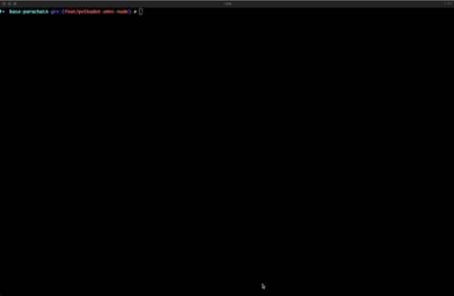

# Build you Chain Spec

The chain specification ("chain spec") captures the initial state and configuration of your chain. Nodes use it to start
a network or to join and sync with an existing one. With Pop CLI you can generate a plain chain spec interactively or
non‑interactively, and optionally produce extra artifacts such as genesis state and wasm code, and even inject a
deterministically built runtime.

## Interactive walkthrough

Run the command without arguments to be guided through all choices:

```bash
pop build spec
```

This will prompt you for key values like output file name, chain id, relay chain, chain type, protocol id,
properties, whether to generate genesis files, and whether to build and inject a deterministic runtime.

<figure><figcaption></figcaption></figure>

> Tip: You can press Tab to accept defaults and type to filter list selections.

### What you’ll typically provide

- Output file name/path for the plain spec (default: ./chain-spec.json)
- Chain (Parachain) ID (default: 2000)
- Chain type (Development / Local / Live)
- Relay chain (paseo, westend, kusama, polkadot and their local variants)
- Protocol ID and optional properties (token symbol/decimals/SS58)
- Whether to also generate genesis state and genesis code files
- Optional: Build the runtime deterministically and inject it into the spec

## Non‑interactive usage

Prefer to skip prompts? Provide flags up front.

```bash
# Minimal example: write a plain chain spec
pop build spec -o ./chain-spec.json

# Provide basics explicitly
pop build spec -o ./chain-spec.json \
  --id 2000 \
  --type Local \
  --relay paseo \
  --protocol-id my-protocol \
  --properties "tokenSymbol=UNIT,decimals=12"

# Include build profile, features, and skip building binaries (if already built)
pop build spec -o ./chain-spec.json \
  --profile release \
  --features foo,bar \
  --skip-build

# Also generate genesis state and wasm code files alongside the spec
pop build spec -o ./chain-spec.json \
  --genesis-state \
  --genesis-code
```

### Deterministic runtime build and injection (optional)

Pop CLI can build your runtime deterministically using srtool and inject the resulting wasm code into the chain spec
generation flow.

```bash
# Minimal deterministic build example
pop build spec --deterministic --runtime ./runtime/mainnet

# Optionally specify the runtime package name used by srtool
# note: --package is only applicable when --deterministic is set
pop build spec --deterministic --runtime ./runtime/mainnet --package parachain-template-runtime
```

Notes about flags:

- You can now pass --runtime without --deterministic to pre-select the runtime directory for the command. This alone
  will not trigger a deterministic build you must add --deterministic to enable srtool.
- The --package flag is available to explicitly set the runtime package name when doing a deterministic build; if
  omitted, Pop CLI will infer it from the runtime directory.

> [!TIP]
> Omni-node-based chains: If your chain uses the community `polkadot-omni-node` host (ships only a runtime), you can still
use `pop build spec` the same way. Deterministic builds are recommended; Pop can also auto-source the
`polkadot-omni-node` binary when needed in related workflows.

## Outputs

Depending on the flags used you’ll get:

- A plain chain spec JSON.
- Optionally, a raw chain spec JSON.
- Optionally, a genesis state file.
- Optionally, a genesis wasm code file.


#### Learning Resources

- 🧑‍🏫 Background on Polkadot/Parachains: wiki.polkadot.network
- 🧑‍🔧 srtool: https://github.com/paritytech/srtool

**Need help?**

Ask on Polkadot Stack Exchange (tag it `pop`) or drop by our Telegram: https://t.me/onpopio. We're here to help!
