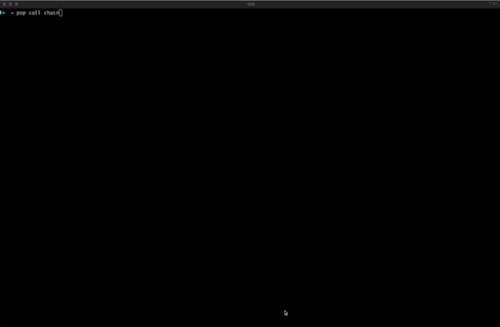
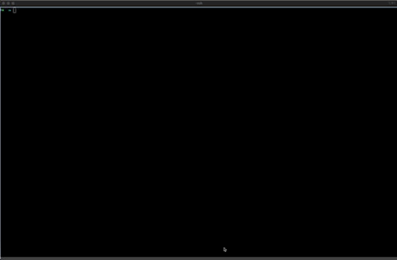

# Call

### Interactive Guidance (Recommended)

Interact with a chain **using** Pop CLI's interactive guidance by simply entering:

```shell
pop call chain
```

First, you will be prompted to select which chain you want to interact with from a list of available chains. You can *
*type to filter** the list and quickly find your desired chain. If you want to connect to a custom RPC endpoint, select
the **"Custom"** option, which allows you to manually type the chain URL.

After selecting your chain, you will be prompted to select a pallet, then choose what you want to do with that pallet:

- **Execute an extrinsic** (dispatchable function)
- **Query storage** items
- **Read constant** values

After making your selection, you'll be guided through providing any required arguments and (for extrinsics) the account
to sign the transaction.

### What Can You Do?

The `pop call chain` command supports three types of operations:

#### 1. Execute Extrinsics

Submit transactions to the chain by calling dispatchable functions. These require signing and will modify chain state.

#### 2. Query Storage

Read storage items from the chain's state. Storage queries don't require signing and can read:

- **Plain storage values** (e.g., System::Number - the current block number)
- **Storage maps** (e.g., System::Account - account information by address)

#### 3. Read Constants

Access constant values defined in the runtime metadata (e.g., System::Version, System::BlockHashCount).

### Manual (non-interactive)

If you prefer not to use interactive prompts, you can call the chain by specifying all the required arguments directly:

#### Executing an Extrinsic

You can execute an extrinsic by specifying the pallet and function (dispatchable function name) and any arguments.

> [!TIP]
> If you receive "Pallet not found" or "Function not found" errors, double-check the case of your pallet and function
> names. Common examples: use "Balances" (not "balances"), "transfer_keep_alive" (not "transferKeepAlive").

```shell
pop call chain --pallet System --function remark --args "0x11" --url ws://localhost:9944 --suri //Alice --sudo
```



#### Querying Storage

You can query storage items by specifying the pallet and function (storage item name).
Storage queries return the current value immediately without requiring transaction signing.

```shell
pop call chain --pallet Sudo --function Key --url wss://pas-rpc.stakeworld.io -y
```

```shell
pop call chain --pallet System --function Account --args 0xb815821c5b300d1667d5fc081c06cc4b6addffb90464d68d871ee363b01a127c --url wss://pas-rpc.stakeworld.io -y
```



#### Reading Constants

Query constant values from the runtime.
Constants are read directly from metadata and don't require signing or keys.

```shell
pop call chain --pallet System --function Version --url wss://pas-rpc.stakeworld.io -y
```

```shell
pop call chain --pallet System --function BlockHashCount --url wss://pas-rpc.stakeworld.io -y
```

### Additional Options

#### Sudo Calls

To dispatch a call with Root origin when the chain's runtime includes `pallet-sudo`, you can wrap the call in a
`sudo.sudo()` call by using the `--sudo` flag:

```shell
pop call chain --pallet System --function remark --args "0x11" --url ws://localhost:9944 --suri //Alice --sudo
```

#### Using Wallet for Signing

You can use a browser extension wallet to sign extrinsics instead of providing a secret URI:

```shell
pop call chain --pallet System --function remark --args "0x11" --url ws://localhost:9944/ --use-wallet
```

Or use the shorthand `-w`:

```shell
pop call chain --pallet System --function remark --args "0x11" --url ws://localhost:9944/ -w
```

#### Direct Call Data Submission

If you already have the SCALE-encoded call data and want to directly submit the extrinsic:

```shell
pop call chain --call 0x00000411 --url ws://localhost:9944/ --suri //Alice
```

```
┌   Pop CLI : Call a chain
│
⚙  Encoded call data: 0x00000411
│  
◇  Do you want to submit the extrinsic?
│  Yes 
│
◇  Extrinsic submitted successfully with hash: "0x60b10fa42fa7bb9e36460d199cef55b28b41dae3f9bb3326fc0e584009ce305b"
│
└  Call complete.
```

#### Skip Confirmation

Use the `--skip-confirm` or `-y` flag to automatically submit extrinsics without prompting for confirmation. This also
prevents the prompt to perform another call:

```shell
pop call chain --pallet System --function remark --args "0x11" --url ws://localhost:9944/ --suri //Alice -y
```

This is particularly useful for scripting and automation.

#### Quick URL Entry

When prompted for a chain, you can select "Custom" to quickly type the chain URL manually, accelerating the process when
you already know the endpoint.

### Interactive Features

When using the interactive mode, you'll experience:

- **Predefined Actions**: Quick access to common operations like creating assets, transferring balances, etc.
- **Filtered Selection**: Type to filter through pallets and functions for faster navigation
- **Visual Indicators**: Clear labels showing whether an item is an `[EXTRINSIC]`, `[STORAGE]`, or `[CONSTANT]`
- **Documentation**: Inline documentation for each pallet and function
- **Repeat Calls**: After completing an operation, you'll be asked if you want to perform another call (unless
  `--skip-confirm` is used)

### Examples

#### Example 1: Query Current Block Number

```shell
pop call chain --pallet System --function Number --url ws://localhost:9944/
```

#### Example 2: Check an Account Balance

```shell
pop call chain --pallet System --function Account --args "5GrwvaEF5zXb26Fz9rcQpDWS57CtERHpNehXCPcNoHGKutQY" --url ws://localhost:9944/
```

#### Example 3: Read Runtime Version

```shell
pop call chain --pallet System --function Version --url ws://localhost:9944/
```

#### Example 4: Transfer with Wallet

```shell
pop call chain --pallet Balances --function transfer_keep_alive --args "5FHneW46xGXgs5mUiveU4sbTyGBzmstUspZC92UhjJM694ty" "1000000000000" --url wss://rpc.polkadot.io --use-wallet
```

#### Example 5: Sudo Call with Auto-confirm

```shell
pop call chain --pallet System --function set_code --args "./runtime.wasm" --url ws://localhost:9944/ --suri //Alice --sudo -y
```

**Need help?**

Ask on [Polkadot Stack Exchange](https://polkadot.stackexchange.com/) (tag it [`pop`](https://substrate.stackexchange.com/tags/pop/info)) or drop by [our Telegram](https://t.me/onpopio). We're here to help!
