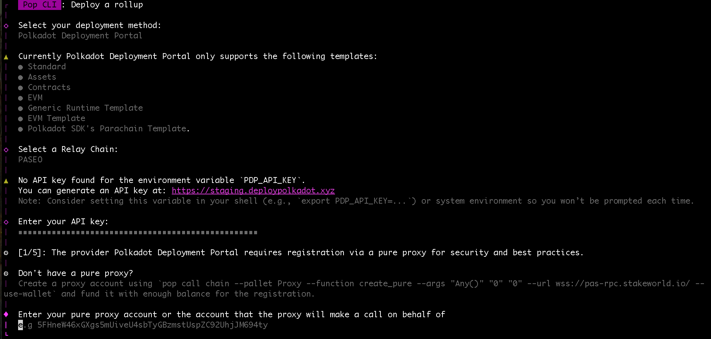

# Deploy a chain with Polkadot Deployment Portal

Pop CLI integrates an external provider for chain deployment, streamlining the process with seamless automation. It handles registration, as detailed in [Launch a Chain to Paseo](launch-a-chain-to-paseo.md), and once the chain is registered, Pop CLI completes the deployment by integrating with the provider. The provider manages collators and offers a portal UI for monitoring your chain’s status.

### Accessing the Polkadot Deployment Portal (PDP)

Start by [signing up to be a beta tester](https://docs.google.com/forms/d/1th3GKJCSjzrmqwzDs62yA1hGUZnQUCPqmaUYLwSiHo4/viewform?edit_requested=true) to request access to the [Polkadot Deployment Portal](https://www.deploypolkadot.xyz/).

Once accepted, you’ll receive an API key required to deploy through Pop CLI. Keep this key safe, you’ll need it during setup.

> **Note:** Currently, the only supported deployment provider is the [Polkadot Deployment Portal](https://www.deploypolkadot.xyz/), which supports a limited set of templates, built-in collator management, and deployment tracking via its UI.

> **Important:** For now, use the [**staging portal**](https://staging.deploypolkadot.xyz/), this is the version integrated with Pop CLI during the beta phase.

### Starting the Deployment Process

Once you have your API key and access to the Polkadot Deployment Portal, you're ready to deploy your chain.

Execute the following command to start the interactive deployment process:

```shell
pop up
```

Follow the interactive guide:

<figure><figcaption><p>pop up flow</p></figcaption></figure>

At the end of the process, Pop CLI will display the URL to the external provider's portal, where you can monitor the status of your deployment. For example, after a successful deployment, the [Polkadot Development Portal](https://www.deploypolkadot.xyz/) provides a UI like the one shown below:

<figure><figcaption><p>Polkadot Development Portal UI</p></figcaption></figure>

During the process, Pop CLI will prompt you for two important choices:

1. Whether to use a pure proxy for registration.
2. Whether to build the runtime deterministically.

#### What is a Pure Proxy?

A pure proxy is an account without private keys, controlled entirely by a designated proxy.

The proxy defines what kind of actions the controller account is allowed to perform on behalf of the pure proxy. There are different [proxy types](https://wiki.polkadot.network/learn/learn-proxies/#proxy-types), each with a specific scope of permissions.

The `ParaRegistration` proxy is designed to limit permissions strictly to paraID reservation and rollup registration, and is recommended for this use case.

> **Note**: `ParaRegistration` is a newly introduced proxy type. Before its availability, the common approach was to use the `Any` proxy as a more general alternative.

_Why Use a Pure Proxy?_

A pure proxy enhances security by keeping private keys hidden and delegating control to an any proxy. It simplifies multisig setups by allowing signatory changes without creating a new account. Highly recommended for parachain registration!

To create a pure proxy run:

```shell
pop call
```

```
┌   Pop CLI : Call a chain
│
◇  Which chain would you like to interact with?
│  wss://pas-rpc.stakeworld.io
│
◇  What would you like to do?
│  Create a pure proxy 
│
◇  Select the value for the parameter: proxy_type
│  Any 
│
◇  Enter the value for the parameter: delay
│  0
│
◇  Enter the value for the parameter: index
│  0
│
```

Once the pure proxy is created, retrieve the generated address from the event `PureCreated` and fund it using the [Paseo Faucet](https://faucet.polkadot.io/) to enable transaction execution.

<figure><figcaption></figcaption></figure>

#### What is a Deterministic Runtime Build?

By default, the Rust compiler generates optimized Wasm binaries, but they aren't always deterministically reproducible. If the Wasm runtime isn't deterministic, each build might produce slightly different bytecode, This can be a problem for blockchain networks where every node must run the exact same runtime.

For a complete walkthrough on deterministic builds using Pop CLI, check out our dedicated guide: 👉 [Build your runtime deterministically](../build-deterministic-runtime.md)

This build requires [Docker](https://www.docker.com/) or [Podman](https://podman.io/) to be installed and running. Pop CLI automatically invokes the `SRTool` image to generate a reproducible and verifiable runtime.

## Resources

#### Learning Resources

* 🧑‍🏫 [https://docs.polkadot.com/develop/parachains/deployment/](https://docs.polkadot.com/develop/parachains/deployment/)
  * ⭕ Learn more about deterministic runtimes [here](https://docs.polkadot.com/develop/parachains/deployment/build-deterministic-runtime/).
* 🧑‍🔧 Learn more about [Pure Proxies Accounts](https://wiki.polkadot.network/docs/learn-proxies-pure).
* [Polkadot Deployment Portal Documentation](https://www.deploypolkadot.xyz/docs).

**Need help?**

Ask on [Polkadot Stack Exchange](https://polkadot.stackexchange.com/) (tag it [`pop`](https://substrate.stackexchange.com/tags/pop/info)) or drop by [our Telegram](https://t.me/onpopio). We're here to help!
