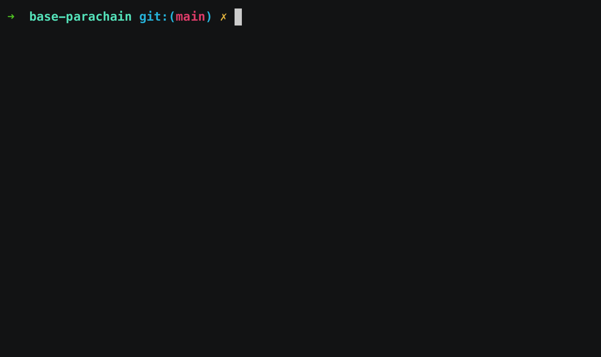

# Launch a Chain to Paseo

[Paseo](https://x.com/PaseoNetwork) is the community-run Polkadot Relay chain Testnet. You can test onboarding a chain locally on Paseo Local before deploying it to the live Paseo Testnet.

#### Paseo Local

If you want to test onboarding a chain on your local machine you need to [launch Paseo](spinning-up-the-polkadot-network.md).

#### Paseo Live

Otherwise you will onboard to [Paseo](https://polkadot.js.org/apps/?rpc=wss%3A%2F%2Frpc.ibp.network%2Fpaseo#/explorer).

> Note: if not specified, all the following steps are the same for launching on Paseo Local / Live.

## Generate Operational Keys

See here how to [generate keys](keys.md).

### Collator Keys

When running a parachain collator, you typically need **two** distinct key pairs:

1. **Stash Account** – A “long-term savings” or bonded account used for staking or holding tokens on behalf of the collator. This account holds the majority of your funds but is kept protected from routine usage.

2. **Session Key** – The account the collator uses to sign and produce blocks in the network. If compromised, an attacker only gains the ability to author blocks, not access the stash account’s large reserve of funds.

> **Collator:** A collator is the parachain node responsible for producing blocks and maintaining the parachain’s state.

### Chain Manager Key
This account pays for actions like para ID reservation, parachain registration, and acquiring coretime.

### Fund Chain Manager

Now that we have a Chain Manager account we need to fund this account with tokens to perform transactions on behalf of the collator.

#### Paseo Local

```bash
pop call chain --pallet Balances --function transfer_allow_death --url ws://localhost:57731/ --suri //Alice
```
```bash
┌   Pop CLI : Call a chain
│
◇  Select the value for the parameter: dest
│  Id 
│
◇  Enter the value for the parameter: Id
│  <CHAIN MANAGER ACCOUNT SS58 ADDRESS>
│
◇  Enter the value for the parameter: value
│  1000000000000000
│
...
```

> Note: the `--url ws://localhost:57731` parameter should point to a [Paseo Local node](spinning-up-a-polkadot-network/spinning-up-the-polkadot-network.md#network-endpoints).

#### Paseo Live

Request PAS tokens on [Paseo Faucet](https://faucet.polkadot.io/).

## Setting up the Chain

For the sake of this exercise, let's create a new chain project:
```
pop new parachain my-chain
```
> The folder includes a `network.toml` file which can be ignored. This is to launch a network with the chain already onboarded.

### Generate the chain spec

The chain specification holds all the information the node requires to start or sync with the chain's network.

Let's generate a chain spec:

<figure><figcaption><p></p></figcaption></figure>

> For more advanced customization `pop build spec --help`

Open the `chain-spec.json` file in your editor.&#x20;

Make sure to edit your chain spec and:&#x20;

* **add your account and session keys**
* **specify the starting balance of specific accounts**
* **add the account that will be the sudo account for your chain**

It should look similar to the below:

```json
{
  "name": "My Chain",
  "id": "my_chain",
  "chainType": "Local",
  "bootNodes": [],
  "telemetryEndpoints": null,
  "protocolId": "my_chain",
  "properties": {
    "ss58Format": 42,
    "tokenDecimals": 12,
    "tokenSymbol": "UNIT"
  },
  "relay_chain": "paseo",
  "para_id": 2000,
  "codeSubstitutes": {},
  "genesis": {
    "runtimeGenesis": {
      "code": "...",
      "patch": {
        "balances": {
          "balances": [
            [
              "INSERT_SS58_STASH_ACCOUNT_KEY_COLLATOR_1",
              1152921504606846976
            ],
            [
              "INSERT_SS58_STASH_ACCOUNT_KEY_COLLATOR_2_OPTIONAL",
              1152921504606846976
            ],
          ]
        },
        "collatorSelection": {
          "candidacyBond": 16000000000,
          "invulnerables": [
            "INSERT_SS58_STASH_ACCOUNT_KEY_COLLATOR_1",
            "INSERT_SS58_STASH_ACCOUNT_KEY_COLLATOR_2_OPTIONAL"
          ]
        },
        "parachainInfo": {
          "parachainId": 2000
        },
        "polkadotXcm": {
          "safeXcmVersion": 4
        },
        "session": {
          "keys": [
            [
              "INSERT_SS58_STASH_ACCOUNT_KEY_COLLATOR_1",
              "INSERT_SS58_STASH_ACCOUNT_KEY_COLLATOR_1",
              {
                "aura": "INSERT_SS58_SESSION_KEY_COLLATOR_1"
              }
            ],
            [
              "INSERT_SS58_STASH_ACCOUNT_KEY_COLLATOR_2_OPTIONAL",
              "INSERT_SS58_STASH_ACCOUNT_KEY_COLLATOR_2_OPTIONAL",
              {
                "aura": "INSERT_SS58_SESSION_KEY_COLLATOR_2_OPTIONAL"
              }
            ]
          ]
        },
        "sudo": {
          "key": "INSERT_SS58_SUDO_ACCOUNT_KEY"
        }
      }
    }
  }
}
```

Since we have modified our chain spec, we will need to re-generate the raw chain spec, genesis state and wasm:

```bash
pop build spec --chain chain-spec.json --disable-default-bootnode --genesis-state --genesis-code  
```
```bash
┌   Pop CLI : Generate your chain spec
│
◇  An existing chain spec file is provided. Do you want to make additional changes to it?
│  No 
```

> Pop CLI allows you to provide the path to an existing chain spec file to edit or regenerate the artifacts.

We are now ready to sync with Paseo and start producing blocks!

## Launch the Chain

In order to run your parachain's collator, you will need the raw chain spec of Paseo.

#### Paseo Local

The chain spec file can be found in the output of `pop up network -f network --verbose`. Copy the chain spec file into the `my-chain` directory:

```bash
cd my-chain
cp /var/folders/vl/txnq6gdj22s9rn296z0md27w0000gn/T/zombie-ddb5d2aa-704b-4658-af64-3cf9e3be5573/alice/cfg/paseo-local.json paseo-local-raw.json
```
> Note: Your Paseo chain spec path may differ from the example above.

#### Paseo Live

Copy the [Paseo chain spec file](https://github.com/paseo-network/runtimes/blob/main/chain-specs/paseo-local.raw.json) into the my-chain directory:

### Generate Node Key

We need to generate a node-key for the collator:

#### Using Docker

```bash
cd my-chain
mkdir -p data/chains/my_chain/network
docker run -it parity/subkey:latest generate-node-key > ./data/chains/my_chain/network/secret_ed25519
```

#### On your Machine

```
path/to/polkadot-sdk/target/debug/substrate-node key generate-node-key --file=secret_ed25519 --chain=./chain-spec-raw.json
```

<pre><code><strong>mv secret_ed25519 data/chains/my_chain/network
</strong></code></pre>

### Run Collator

Run the collator with the following command:

```
./target/release/parachain-template-node \
--collator \
--force-authoring \
--chain chain-spec-raw.json \
--base-path ./data \
--port 40333 \
--rpc-port 8845 \
-- \
--sync warp \
--chain paseo-local-raw.json \
--port 57733 \
--rpc-port 57731
```

> The second half of this command specifies the Relay chain node to connect to.

The `--base-path ./data` is specified because the node key was placed into `my-chain/data`. You could use the `--unsafe-force-node-key-generation` flag to delegate the key generation to the node itself (**IMPORTANT**: not advised for a live testnet).

Last, we need to insert the session key into our running collator so that it can sign operational transactions:

```bash
curl -H "Content-Type: application/json" \
--data '{
  "jsonrpc":"2.0",
  "method":"author_insertKey",
  "params":[
    "aura",
    "INSERT_SECRET_SESSION_SEED_PHRASE",
    "INSERT_PUBLIC_SESSION_KEY_HEX_FORMAT"
  ],
  "id":1
}' \
http://localhost:8845
```

Well done! Now look at the logs of your chain and you should see it being synced with Paseo!!!
```bash
2024-12-10 09:06:05 [Relaychain] Warp sync is complete, continuing with state sync.    
2024-12-10 09:06:06 [Relaychain] State sync is complete, continuing with block sync.    
2024-12-10 09:06:06 [Relaychain] 🏆 Imported #47 (0xb04f…12a4 → 0x6adf…6582)    
2024-12-10 09:06:06 [Relaychain] 🏆 Imported #48 (0x6adf…6582 → 0xd036…e502) 
```

Last step is to onboard the chain to Paseo.

### Onboard Chain to Paseo

`pop up` simplifies the process of onboarding a chain to Paseo by automating both the reservation of an ID and its registration. Take the generated genesis state (`para-2000-genesis-state`) and genesis code (`para-2000.wasm`) and run: 
 
```bash
pop up --genesis-state ./para-2000-genesis-state --genesis-code para-2000.wasm 
```

<figure><figcaption><p>pop up</p></figcaption></figure>


#### Manual registration
If you prefer, you can still execute the steps separately using `pop call chain`.

We can reserve a para ID for the chain using pop cli:

```bash
pop call chain --url ws://localhost:57731
```
 
```bash
┌   Pop CLI : Call a chain
│
◇  What would you like to do?
│  Reserve a parachain ID 
│
◇  Do you want to use your browser wallet to sign the extrinsic? (Selecting 'No' will prompt you to manually enter the secret key URI for signing, e.g., '//Alice')
│  No
│
◇  Signer of the extrinsic:
│  <CHAIN MANAGER ACCOUNT>
│  
...
       Event Balances ➜ Reserved
         who: <CHAIN MANAGER ACCOUNT>
         amount: 100UNIT
       Event Registrar ➜ Reserved
         para_id: Id(2000)
         who: <CHAIN MANAGER ACCOUNT>
...         
```

In the events we can see the `para_id` that is assigned to the chain. Make sure this is the para ID specified in the chain spec file (and thus the chain artifacts).

Now we register the para ID with the generated genesis state (`para-2000-genesis-state`) and genesis code (`para-2000.wasm`).

```bash
│
◇  Do you want to perform another call?
│  Yes
│
◇  What would you like to do?
│  Register a parachain ID with genesis state and code
│
◇  Enter the value for the parameter: id
│  2000
│
◇  The value for `genesis_head` might be too large to enter. You may enter the path to a file instead.
│  para-2000-genesis-state
│
◇  The value for `validation_code` might be too large to enter. You may enter the path to a file instead.
│  para-2000.wasm
│
◇  Do you want to use your browser wallet to sign the extrinsic? (Selecting 'No' will prompt you to manually enter the secret key URI for signing, e.g., '//Alice')
│  No
│
◇  Signer of the extrinsic:
│  <CHAIN MANAGER ACCOUNT>
│
...
       Event Balances ➜ Withdraw
         who: <CHAIN MANAGER ACCOUNT>
         amount: 90.71989507390UNIT
       Event Balances ➜ Reserved
         who: <CHAIN MANAGER ACCOUNT>
         amount: 3.145826kUNIT
       Event Paras ➜ PvfCheckStarted
         0: ValidationCodeHash(0x1821617486094e18595084b580fe9324a084adedbf80ec61c9d7b75736ab5f5b)
         1: Id(2000)
       Event Registrar ➜ Registered
         para_id: Id(2000)
         manager: <CHAIN MANAGER ACCOUNT>
...
```

Your chain is now registered on Paseo and should produce a block!

In order to validate and get your block finalised by the Relay chain, see [here](./coretime.md) how to acquire core time.

> Note:
In the examples above, you are prompted to provide a `<private-key>` to interact with the chain. However, this implies a potentially insecure way of handling private keys and should only be used for development accounts.
For production accounts and enhanced security, Pop CLI offers the `--use-wallet` option to securely sign transactions. Refer to the [Securely sign transactions from CLI guide](../securely-sign-transactions-from-cli.md) for detailed instructions.

## Resources

#### Learning Resources

* [https://paritytech.github.io/devops-guide/guides/parachain\_deployment.html](https://paritytech.github.io/devops-guide/guides/parachain\_deployment.html)
* 🧑‍🏫 To learn about Polkadot in general, [Polkadot.network](https://polkadot.network/) website is a good starting point.
  * ⭕ Learn more about parachains [here](https://wiki.polkadot.network/docs/learn-parachains).
* 🧑‍🔧 For technical introduction, [here](https://github.com/paritytech/polkadot-sdk#-documentation) are the Polkadot SDK documentation resources.

**Technical Support**

* [Polkadot Stack Exchange](https://polkadot.stackexchange.com/)
  * Create a question and tag it with "[`pop`](https://substrate.stackexchange.com/tags/pop/info)"
  * Share the StackExchange question in our [Pop Support Telegram channel](https://t.me/pop\_support)
