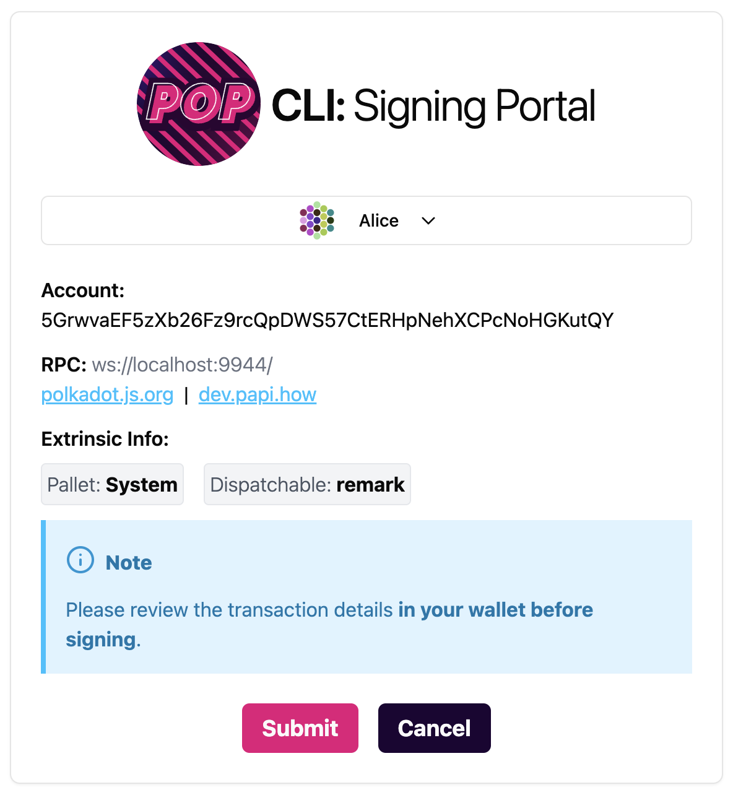
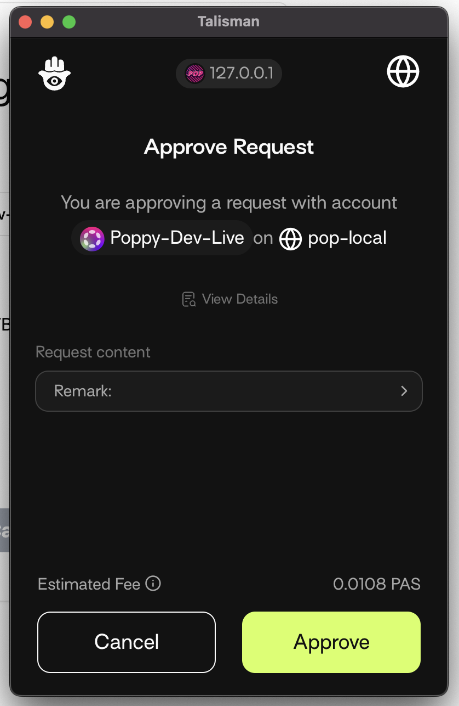

# Securely Sign Transactions from CLI

Pop CLI provides an option to securely sign transactions from the CLI. It does this by opening a signing portal allowing you to sign the transactions using your browser extension wallet.

## Example Usage

For a full guide on calling a chain from Pop CLI, see the [Call a Chain](call-a-chain.md) guide.

Normally, you would provide `--suri=<private-key>` to interact with the chain. However, this implies a potentially insecure way of handling private keys and should only be used for development accounts. For production accounts and more secure signing, Pop CLI provides the `--use-wallet` option that you can use.

Here is an example of calling a chain using `--use-wallet`:

```bash
pop call chain --pallet System --function remark --args "0x11" --url ws://localhost:9944/ --use-wallet --skip-confirm
```

This will open a signing portal in your browser. Pop CLI will display the following:

```bash
◇  Wallet signing portal started at http://127.0.0.1:9090.
│
◒  Waiting for signature... Press Ctrl+C to terminate early.
```

Your browser will open a new tab with the following screen at http://127.0.0.1:9090 (or similar if the port is already in use);

<figure><figcaption><p>Signing Portal Initial Open</p></figcaption></figure>

Click on the `Connect Wallet` button to connect your browser extension wallet.

<figure><figcaption><p>Connect Wallet</p></figcaption></figure>

After connecting your wallet, you will have the option to choose your account and sign the transaction, and finally see the transaction details for signing.

<figure><figcaption><p>Transaction Details</p></figcaption></figure>

Once ready to sign, pressing the `Submit` button will open your wallet for signature.

> ⚠️ **It is important to verify transaction details in your wallet before signing.**

<figure><figcaption><p>Opened Wallet for Signing</p></figcaption></figure>

Signing the transaction will show a success message in the portal. You may close the portal after signing.

After the signed transaction is received, the portal will send the transaction payload to Pop CLI, which will then submit the transaction to the chain.

```bash
◆  Signed payload received.
│
◇  Extrinsic submitted with hash: "0x039076e2760eb1a4d41bf4daf009a0376ba128bd8c51cf365e4a5c5dee07a414"
│
◆  Do you want to perform another call?
│  ○ Yes  / ● No
└
```

**Need help?**

Ask on [Polkadot Stack Exchange](https://polkadot.stackexchange.com/) (tag it [`pop`](https://substrate.stackexchange.com/tags/pop/info)) or drop by [our Telegram](https://t.me/onpopio). We're here to help!
