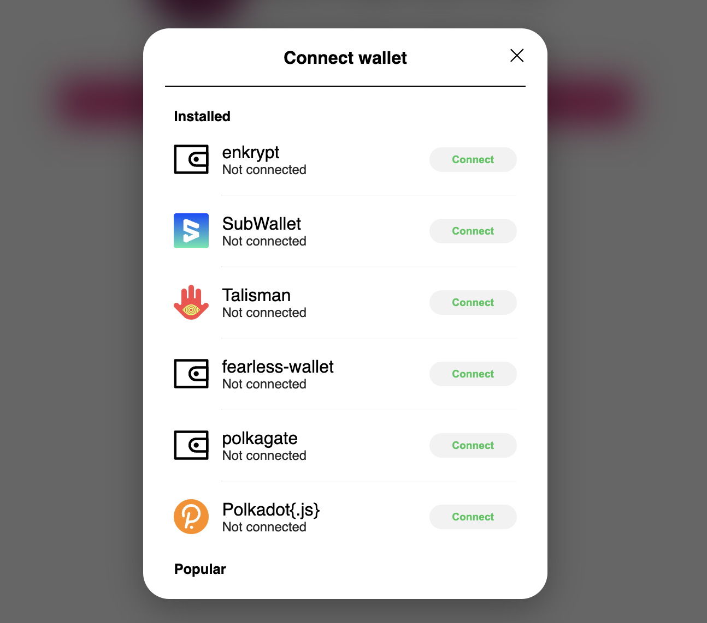
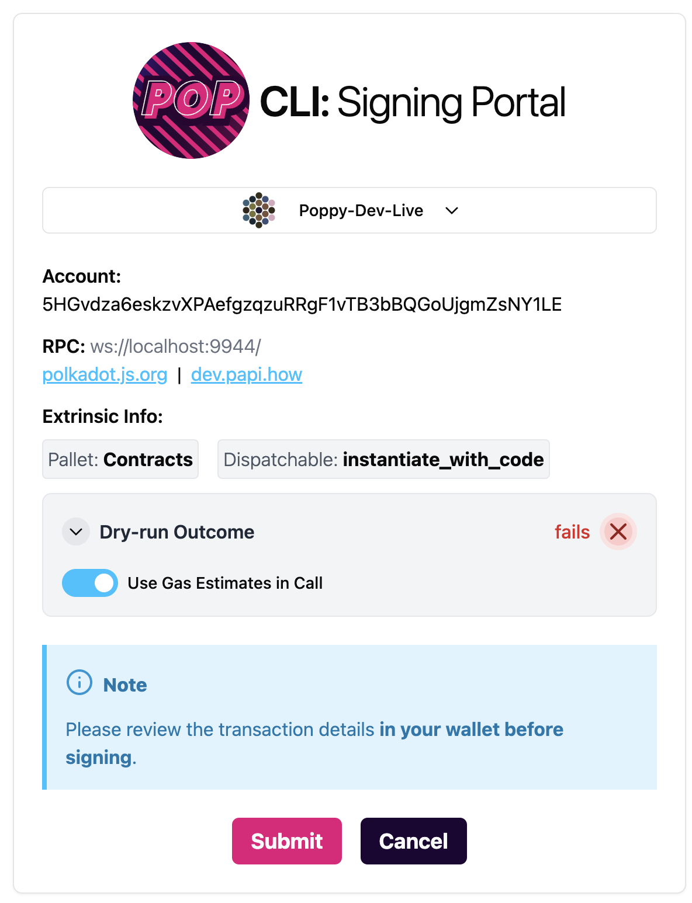
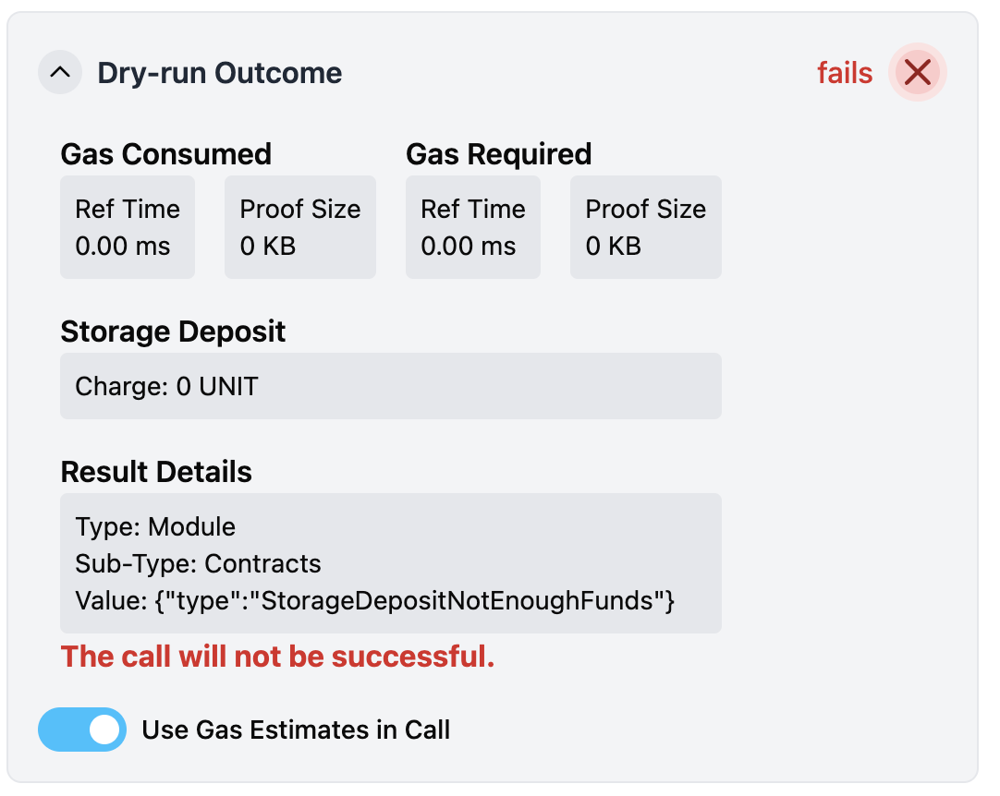

# Securely Sign Transactions from CLI

Pop CLI provides an option to securely sign transactions from the CLI. It does this by opening a signing portal allowing you to sign the transactions using your browser extension wallet.

## Example Usage: Deploying a Contract

For a full guide on deploying a contract, see the [Deploy Your Contract Locally](deploy-your-contract-locally.md) guide.

Normally, you would provide `--suri=<private-key>` to interact with the chain. However, this implies a potentially insecure way of handling private keys and should only be used for development accounts. For production accounts and more secure signing, Pop CLI provides the `--use-wallet` option that you can use.

Here is an example of deploying a contract using `--use-wallet`:

```bash
pop up contract --constructor new --args false --use-wallet
```

This will open a signing portal in your browser. Pop CLI will display the following:

```bash
◇  Wallet signing portal started at http://127.0.0.1:9090.
│
◒  Waiting for signature... Press Ctrl+C to terminate early.
```

Your browser will open a new tab with the following screen at http://127.0.0.1:9090 (or similar if the port is already in use);

<figure><figcaption><p>Signing Portal Initial Open</p></figcaption></figure>

Click on the `Connect Wallet` button to connect your browser extension wallet.

<figure><figcaption><p>Connect Wallet</p></figcaption></figure>

After connecting your wallet, you will have the option to choose your account and sign the transaction, and finally see the transaction details for signing. Note that for contract calls, the portal will perform a dry-run to alert you if the transaction will succeed, and also estimate the gas costs.

<figure><figcaption><p>Transaction Details</p></figcaption></figure>

If the transaction will fail, the dry-run alert will change:

<figure><figcaption><p>Failing Dry Run</p></figcaption></figure>

In this case, you can expand the dry-run alert to see the error details. This example shows an error of the account not having enough funds:

<figure><figcaption><p>Expanded Failing Dry Run</p></figcaption></figure>

Once ready to sign, pressing the `Submit` button will open your wallet for signature.

> ⚠️ **It is important to verify transaction details in your wallet before signing.**

<figure><figcaption><p>Opened Wallet for Signing</p></figcaption></figure>

Signing the transaction will show a success message in the portal. You may close the portal after signing.

After the signed transaction is received, the portal will send the transaction payload to Pop CLI, which will then submit the transaction to the chain.

```bash
◆  Signed payload received.
│
◇  Contract deployed and instantiated:
● The contract address is "5F1P99TD63qZ9bnoxrK7kuzwMWuU7kKKVJJZoVKBYoVQtQeR"
● The contract code hash is "0x9e4bbfc311f58aaffb63d7570651567d40dd76f301f601a0f0a61f3204d49e5b"
```
