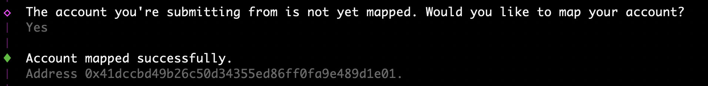
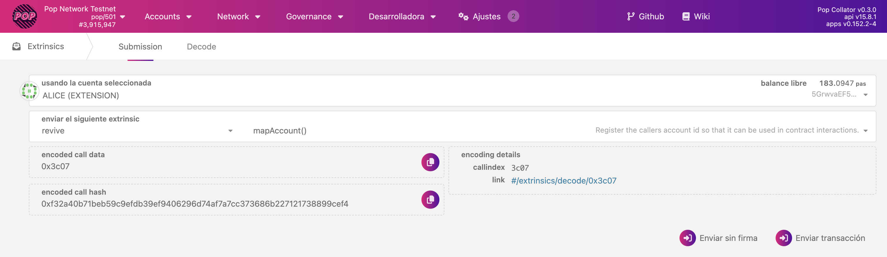

# Getting Started with ink! v6

Pop CLI introduces experimental support for ink! v6 smart contracts running on [PolkaVM (RISC-V)](https://github.com/paritytech/polkavm) via `pallet-revive`. This guide helps you transition from ink! v5 (WebAssembly) and start experimenting with ink! v6.

### What's new in ink! v6?

* **ink! v5**: Version of the ink! that can be compiled into WebAssembly byte code and can be executed on [`pallet-contracts`](https://github.com/paritytech/polkadot-sdk/tree/master/substrate/frame/contracts) virtual machine.
* **ink! v6**: Version of ink! that can be compiled into RISC-V byte code and can be executed on PolkaVM ([`pallet-revive`](https://github.com/paritytech/polkadot-sdk/tree/master/substrate/frame/revive)).

For more information about the benefits of RISC-V and `pallet-revive`, see [RISC-V + pallet-revive](https://use.ink/6.x/current-state#-risc-v--pallet-revive-2025).

### Installing Pop CLI for ink! v6 support

Pop CLI supports ink! v6 through the `polkavm-contracts` feature flag.

To install it from the experimental branch, run:

```
cargo install --git https://github.com/r0gue-io/pop-cli.git --branch v6.0.0-alpha.1 --no-default-features --locked -F polkavm-contracts,chain,telemetry
```

> **⚠️ Note:** Make sure you're using `Rust 1.87` or higher, older versions will fail to compile. You can check your version with rustc `--version`.

### Getting started with ink! v6

The workflow for developing smart contracts remains similar to ink! v5. To get started, see our guide: [Create a new contract](../guides/create-a-new-contract.md).

#### Migrating existing ink! smart contracts

If you already have an ink! smart contract, update your dependencies as follows: Update your `Cargo.toml`

```toml
[dependencies]
ink = { version = "6.0.0-alpha", default-features = false }

[dev-dependencies]
ink_e2e = { version = "6.0.0-alpha" }
```

For a complete example, check the [ink! flipper example](https://github.com/use-ink/ink-examples/tree/v6.x/flipper).

#### Account Mapping

`pallet_revive` enables the deployment and execution of PolkaVM smart contracts. It introduces support for 20-byte accounts (like `EVM`), while most Polkadot-based chains use 32-byte accounts (`AccountId32`). To ensure compatibility, `pallet_revive` provides a mapping feature that lets 32-byte accounts seamlessly interact with the VM.

When first interacting with `pallet_revive`, you must map your Polkadot account ID (32 bytes) to an Ethereum-compatible 20-byte address. This registration enables your account to interact with contracts.

Pop CLI will prompt you automatically:

<figure><figcaption></figcaption></figure>

Alternatively, you can interact on [Polkadot JS Apps](https://polkadot.js.org/apps/#/explorer):

<figure><figcaption></figcaption></figure>

For further information about account mapping, including native EVM contract integration with Asset Hub, see [Native EVM Contracts](https://docs.polkadot.com/develop/smart-contracts/evm/native-evm-contracts/).

## Resources

#### Learning Resources

* [Migrate from ink! v5 → v6](https://use.ink/6.x/faq/migrating-from-ink-5-to-6) in the ink! docs.
  * ⭕ Detailed [ink! v6 Changelog](https://github.com/use-ink/ink/blob/master/CHANGELOG.md#version-600).
* [pallet\_revive](https://paritytech.github.io/polkadot-sdk/master/pallet_revive/index.html) technical documentation.

**Technical Support**

* [Polkadot Stack Exchange](https://polkadot.stackexchange.com/)
  * Create a question and tag it with "[`pop`](https://substrate.stackexchange.com/tags/pop/info)"
  * Share the StackExchange question in our [Pop Support Telegram channel](https://t.me/pop_support)
