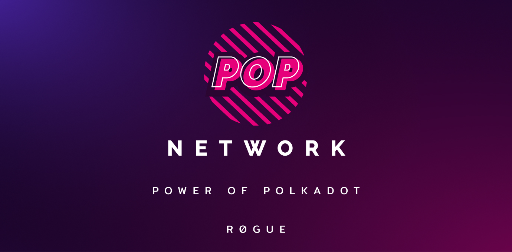

# Pop Network

<figure><figcaption></figcaption></figure>

Pop Network makes it easy for smart contract developers to use the Power of Polkadot. Through curated runtime primitives, smart contract developers can spend less time learning the complexities of Polkadot, and more time buidling awesome things.
