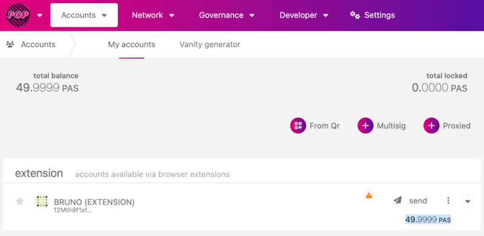

# Get tokens on Pop Network

## Important note

Pop Network is deprioritised and will not be deployed to Polkadot. Testnet will be sunsetted Decemeber 31 2025. More information on this decision can be found [here](https://forum.polkadot.network/t/final-update-pop-network-treasury-proposal-683/14663).

## Introduction

Pop uses the Polkadot Relay chain's native token: **DOT**.&#x20;

Paseo is Polkadot's Testnet. Its relay chain's native token is **PAS**.

This guide will teach you how to bridge **PAS** tokens from the Paseo's Asset Hub to Pop.

### Setup Polkadot Account 

Make sure you have a Polkadot account. You can use one of the following recommended wallets:

* [PolkadotJs Signer Extension](https://polkadot.js.org/extension/)
* [Talisman Wallet](https://www.talisman.xyz/)
* [Nova Wallet](https://novawallet.io/)
* [SubWallet](https://www.subwallet.app/)

### Paseo Faucet 

Go to the [Paseo Faucet](https://faucet.polkadot.io/) and request some PAS tokens. Make sure:

* "Network" is "Paseo"
* "Chain" is "AssetHub"

<figure><figcaption>
Paseo Faucet
</figcaption></figure>

You should now see 100 PAS tokens in your account on Paseo:'s Asset Hub. [Go here to check for yourself!](https://polkadot.js.org/apps/?rpc=wss%3A%2F%2Fasset-hub-paseo.dotters.network#/accounts)

<figure><figcaption>
Account Balance on Paseo's Asset Hub
</figcaption></figure>

### Bridging from Paseo to Pop 

You can use the Pop Onboarding UI to bridge tokens from Paseo to Pop: [https://onpop.io/network/onboard](https://onpop.io/network/onboard)

<figure><figcaption>
Transfer PAS from Paseo's Asset Hub to Pop
</figcaption></figure>

The token amount (minus the tx fee) will appear on Pop:

<figure><figcaption>
Pop Network
</figcaption></figure>

Congrats! You have successfully bridged tokens from Paseo to Pop!
