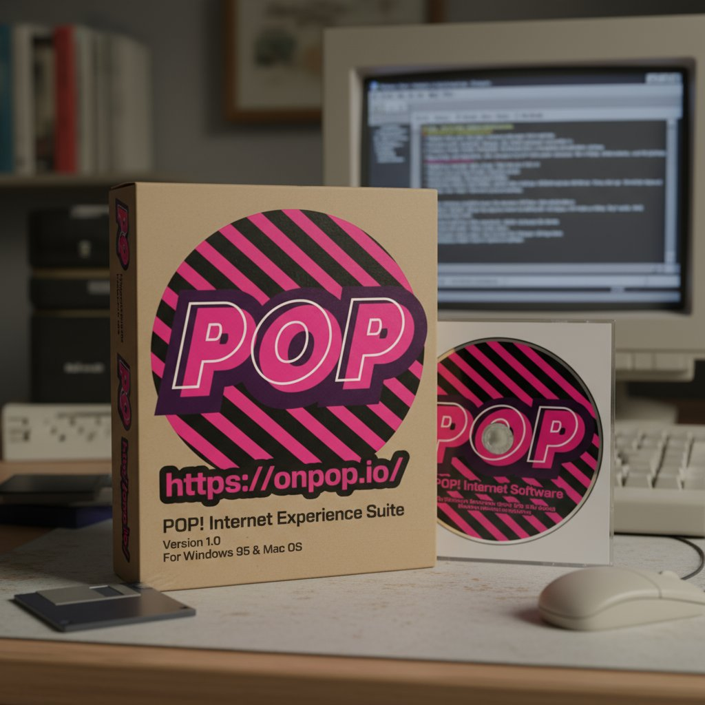

# Pop CLI Hackathon Guide

## Introduction

Pop CLI is an all-in-one tool for Polkadot development. It streamlines both parachain and smart contract workflows so you can go from idea → demo during a hackathon.

Pop CLI simplifies development with:

- Quick initialization of development environment.
- Project scaffolding from predefined templates.
- Easy launch and management of local development networks.

> See also: [Quickstart Parachain Development with Pop CLI (official Polkadot docs)](https://docs.polkadot.com/develop/toolkit/parachains/quickstart/pop-cli/)

### Prerequisites

Follow the install guide to set up Pop CLI and your environment: [Install Pop CLI](./install-pop-cli.md).

To build Polkadot SDK–based chains, ensure your local toolchain is ready: [Install Polkadot SDK Dependencies](https://docs.polkadot.com/develop/parachains/install-polkadot-sdk/).

### Contract Development (ink!) <a href="#contract-development" id="contract-development"></a>
Pop CLI introduces experimental support for [ink! v6 smart contracts](https://use.ink/docs/v6) running on [PolkaVM (RISC-V)](https://github.com/paritytech/polkavm) via `pallet-revive`.

#### TL;DR Flow

```bash
# 1) Scaffold (choose provider/template interactively)
pop new contract

# 2) Build your contract
cd my-contract && pop build --release

# 3) Deploy (Pop CLI will run a local network by default; add `--url` to target a remote RPC)
pop up # `pop up --url wss://passet-hub-paseo.dotters.network`

# 4) Interact with your contract (You can secure signing via browser wallet).
pop call contract # `pop call contract  --use-wallet`
```

##### Handy Links
- [ink! docs](https://use.ink/docs/v6)
- [Launch a Chain to Paseo](../pop-cli-for-appchains/guides/launch-a-chain/launch-a-chain-to-paseo.md)
- [Your first ink! smart contract](../pop-cli-for-smart-contracts/tutorials/your-first-ink-smart-contract.md)
- [Securely Sign Transactions from CLI](../pop-cli-for-smart-contracts/guides/securely-sign-transactions-from-cli.md)


### Chain Development (Parachains) <a href="#chain-development" id="chain-development"></a>
Build and run a local parachain quickly; deploy when ready.

#### TL;DR Flow

```bash
# 1) Scaffold (choose provider/template interactively)
pop new chain

# 2) Build your chain
cd my-chain && pop build --release

# 3) Run a local network (Zombienet config)
pop up network -f ./network.toml
```

Congrats! You’ve spun up a network with your parachain running!
```
┌   Pop CLI : Deploy a parachain
│
◇  🚀 Network launched successfully - ctrl-c to terminate
│  ⛓️ paseo-local
│       alice:
│         portal: https://polkadot.js.org/apps/?rpc=ws://127.0.0.1:62551#/explorer
│         logs: tail -f /var/folders/vl/txnq6gdj22s9rn296z0md27w0000gn/T/zombie-c0eb16fc-5d11-4792-aced-493ef972d056/alice/alice.log
│       bob:
│         portal: https://polkadot.js.org/apps/?rpc=ws://127.0.0.1:62555#/explorer
│         logs: tail -f /var/folders/vl/txnq6gdj22s9rn296z0md27w0000gn/T/zombie-c0eb16fc-5d11-4792-aced-493ef972d056/bob/bob.log
│  ⛓️ local_testnet: 2000
│       collator-01:
│         portal: https://polkadot.js.org/apps/?rpc=ws://127.0.0.1:62559#/explorer
│         logs: tail -f /var/folders/vl/txnq6gdj22s9rn296z0md27w0000gn/T/zombie-c0eb16fc-5d11-4792-aced-493ef972d056/collator-01/collator-01.log
│
```

#### Other useful commands
```bash
# 4) Interact with your chain (You can secure signing via browser wallet).
pop call chain # `pop call chain  --use-wallet`

# 5) Register the rollup on Paseo or deploy using Polkadot Deployment Portal
pop up
# And follow the interactive guide:
┌   Pop CLI : Deploy a rollup
│
◆  Select your deployment method:
│  ● Polkadot Deployment Portal (https://staging.deploypolkadot.xyz)
│  ○ Register
```

##### Handy Links
- [Launch a Chain in Development](../pop-cli-for-appchains/guides/launch-a-chain/running-your-parachain.md)
- [Launch a Chain to Paseo](../pop-cli-for-appchains/guides/launch-a-chain/launch-a-chain-to-paseo.md)
- [Deploy a chain with Polkadot Deployment Portal](../pop-cli-for-appchains/guides/launch-a-chain/deploy-a-chain-polkadot-deployment-portal.md)
- [Securely Sign Transactions from CLI](../pop-cli-for-appchains/guides/securely-sign-transactions-from-cli.md)


### Support & Contribute

- Questions / help? Join our [Telegram](https://web.telegram.org/k/#@pop_support)

- Follow updates on [X](https://x.com/onpopio)

- Found a *bug* or have a *feature request*? [Open an issue](https://github.com/r0gue-io/pop-cli/issues)

- *Want to contribute?* Check out open issues tagged [`good first issue`](https://github.com/r0gue-io/pop-cli/issues?q=is%3Aissue+state%3Aopen+label%3A%22good+first+issue%22)

<figure>
  
</figure>

